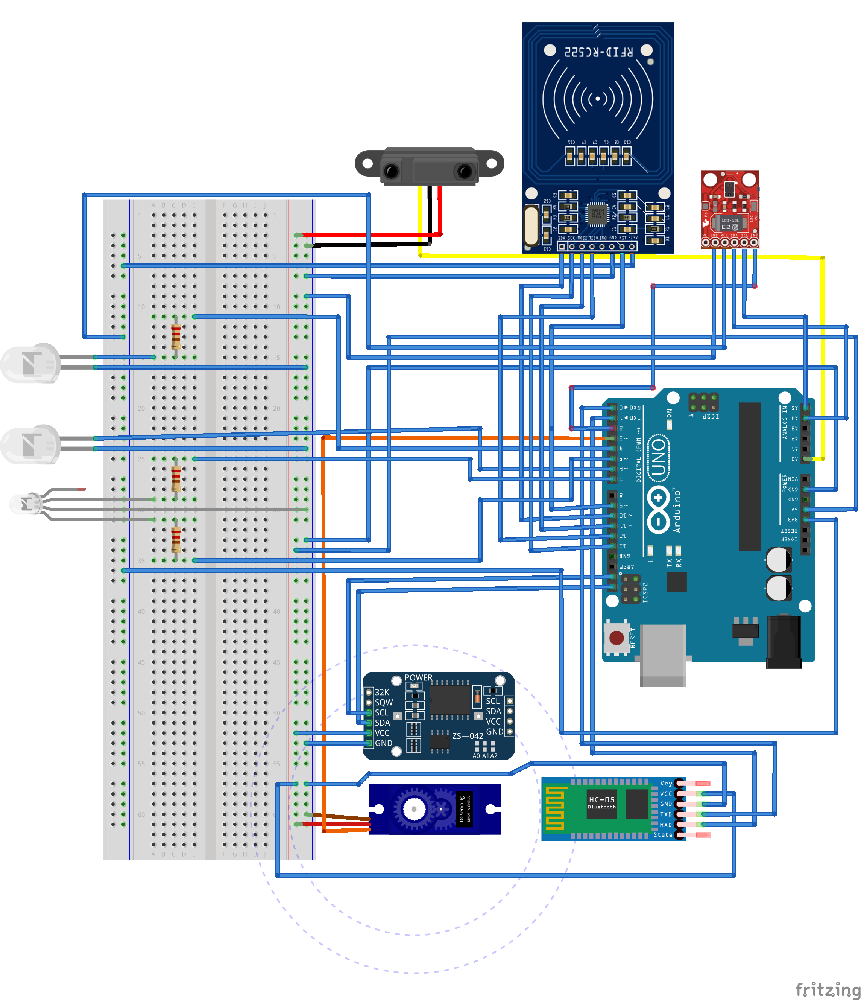
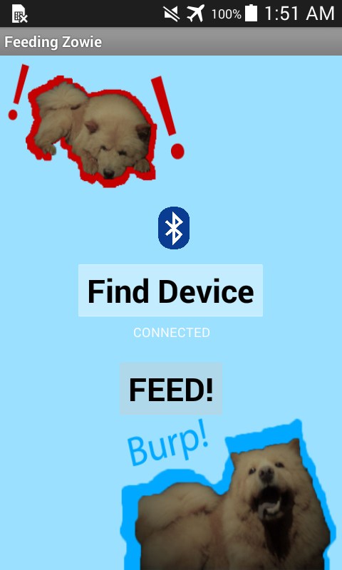

# Arduino-Pet-Food-Dispenser

An Arduino-based project created using Arduino IDE and code written with C++ with an addition of special methods and functions

## About

- Autonomous Pet Food Dispenser

### Schematic Diagram (Fritzing)

### Android App (MIT App Inventor)

## Date Created

October 6, 2018
