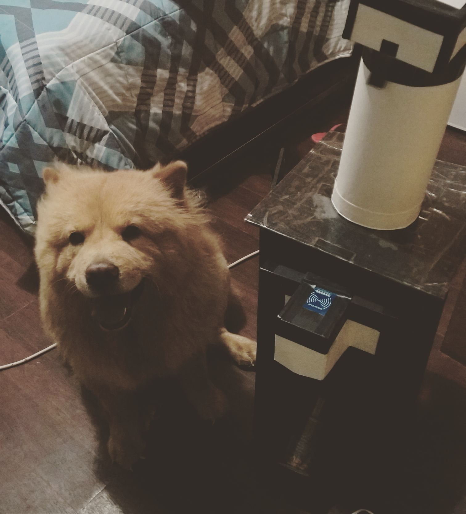
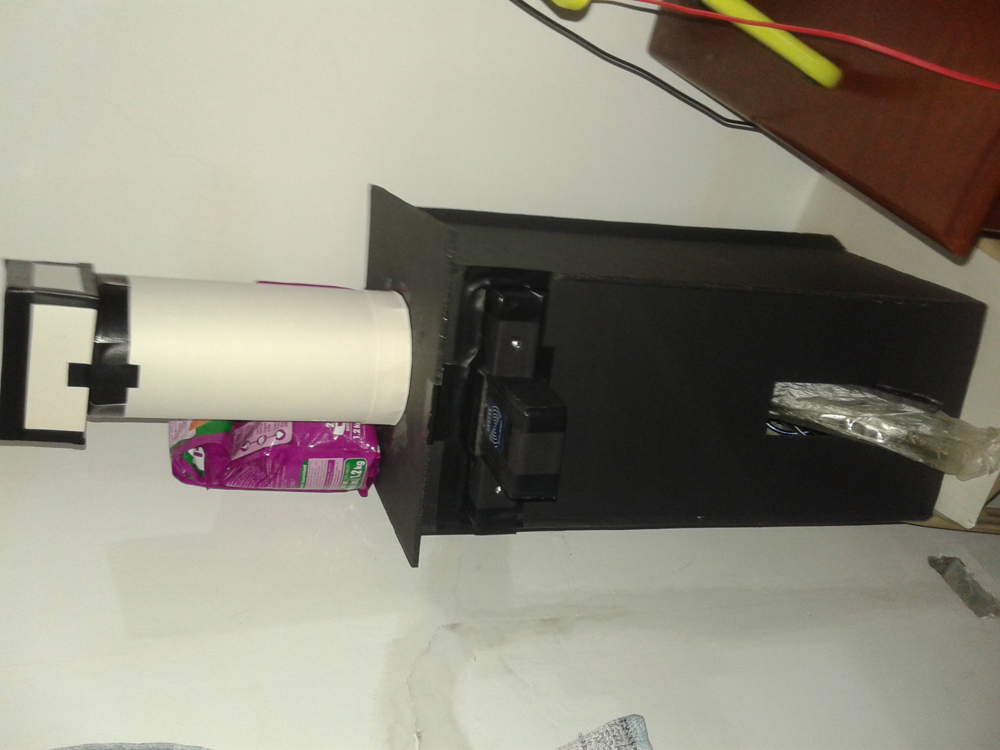
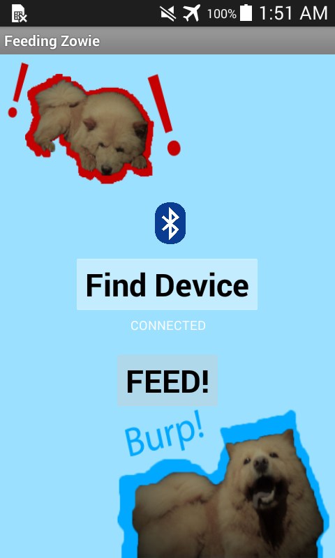
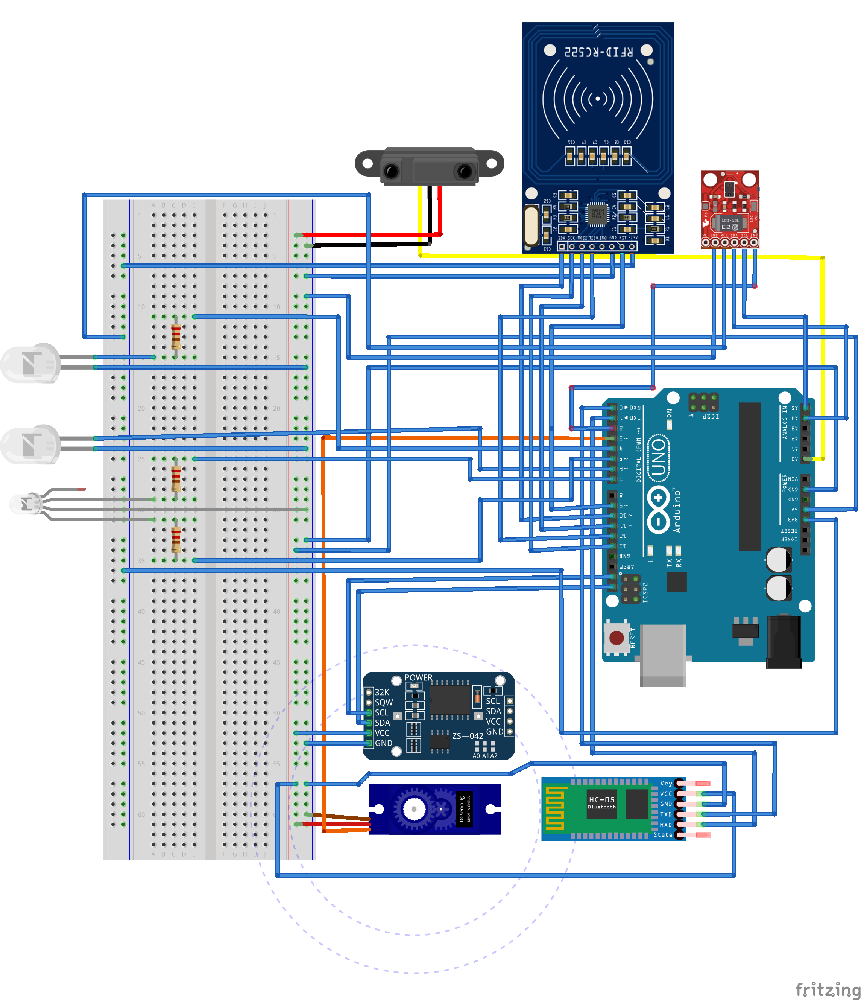

# Arduino-Pet-Food-Dispenser

An Arduino-based project created using Arduino IDE and code written with C++ with an addition of special methods and functions

# About

Autonomous Pet Food Dispenser

### Arduino Board & Modules

<ul>
  <li> Arduino UNO R3 board </li>
  <li> Breadboard </li>
  <li> TowerPro SG90 SG-90 9G Micro Servo </li>
  <li> HC-05 Bluetooth Module Master and Slave </li>
  <li> Distance Sensor 10cm-80cm Sharp IR Infrared GP2Y0A21YK0F </li>
  <li> Light Ambient and Proximity Sensor APDS9900 </li>
  <li> NFC RFID Reader Kit 13.56MHz </li>
  <li> RTC Module DS1307 Arduino </li>
  <li> Dupont Jumper Wire Cables </li>
  <li> RGB LED Clear Common Cathode </li>
  <li> 2 Light-emitting diodes (LEDs) </li>
</ul>

### Android App (MIT App Inventor)

### Schematic Diagram (Fritzing Software)

# Date Created

October 6, 2018
